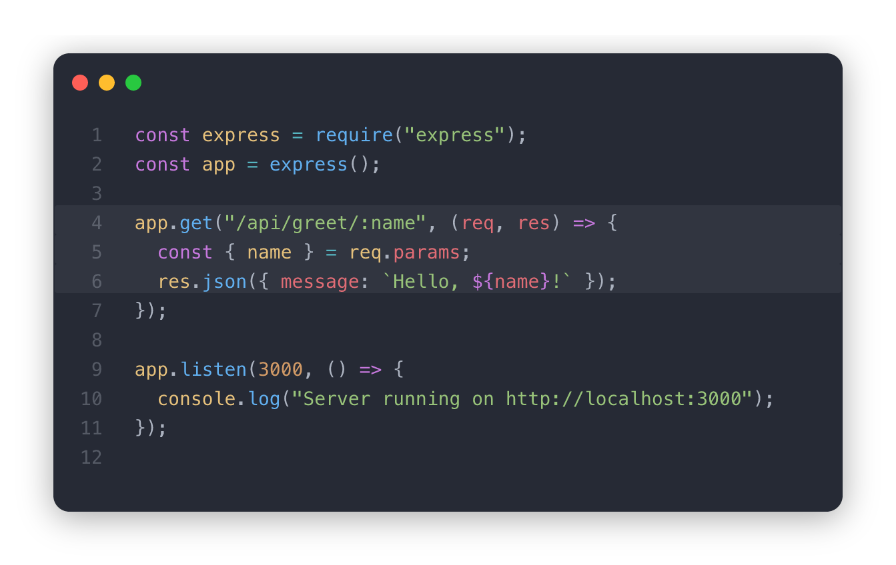

# Local Carbon

> Claude Code Agent Skill — Generate beautiful Mac-style code screenshot PNGs from source files, locally. No network, no browser.

<p align="center">
  = 18">
  
  
</p>

<p align="center">
  
</p>

## Features

- **Carbon-style output** — Mac window buttons, rounded card, drop shadow
- **Shiki syntax highlighting** — 20+ languages with switchable themes
- **Line numbers & line highlighting** — Highlight specific lines for tutorials or code review
- **Retina resolution** — Automatic 2x scaling for crisp, sharp output
- **Custom color rules** — Override specific text colors via regex-based JSON rules
- **Fully offline** — Zero network dependencies, all rendering done locally

## Installation

```bash
cd scripts && npm install
```

## Usage

### As a Claude Code Skill

Add this directory to your Claude Code skill path, then trigger it in conversation with phrases like:

- "screenshot this code"
- "make a code image"
- "carbon screenshot"
- "render code as PNG"

### As a CLI Tool

```bash
node scripts/local-carbon.js <input-file> [output.png] [options]
```

Output defaults to `<input-name>.png` in the same directory as the input file.

## Options

| Flag | Description | Default |
|------|-------------|---------|
| `--theme <name>` | Shiki theme name | `one-dark-pro` |
| `--font-size <n>` | Font size in px | `14` |
| `--no-line-numbers` | Hide line numbers | shown |
| `--lang <language>` | Override auto-detected language | auto |
| `--highlight <lines>` | Highlight specific lines (comma-separated, 1-based) | none |
| `--focus <lines>` | Alias for `--highlight` | none |
| `--width <px>` | Set image width in pixels | auto |
| `--rules <json-file>` | Color-override rules (JSON) | none |

## Examples

Basic usage — auto-detects language and output filename:

```bash
node scripts/local-carbon.js app.js
# → outputs app.png
```

Custom output path and theme:

```bash
node scripts/local-carbon.js main.py screenshot.png --theme github-dark
```

Highlight lines 1, 3, and 5 with a fixed width:

```bash
node scripts/local-carbon.js handler.ts out.png --highlight=1,3,5 --width=800
```

Apply custom color-override rules:

```bash
node scripts/local-carbon.js page.html out.png --rules scripts/rules_example.json
```

## Color-Override Rules

Provide a JSON file mapping regex patterns to hex colors. Matches override the theme's default syntax colors:

```json
{
  "TODO": "#ffb86c",
  "FIXME": "#ff5555",
  "class=\".*?\"": "#50fa7b",
  "https?://.*?[\"\\s]": "#8be9fd"
}
```

When multiple rules match the same position, later entries take precedence.

## Supported Languages

Auto-detected from file extension:

JavaScript, TypeScript, Python, Ruby, Rust, Go, Java, Kotlin, C#, C/C++, Bash, JSON, YAML, TOML, Markdown, HTML, CSS, SQL, Dockerfile, HCL, Zig, and more.

Use `--lang` to override detection.

## Architecture

```
local-carbon/
├── SKILL.md               # Claude Code Skill definition
├── README.md
└── scripts/
    ├── local-carbon.js    # Main script — SVG generation + PNG rendering
    ├── package.json
    └── rules_example.json # Color-override rules example
```

**Rendering pipeline:**

1. Read source file and normalize tabs
2. Tokenize with Shiki syntax highlighter
3. Apply color-override rules (if provided)
4. Calculate layout dimensions
5. Generate SVG (window buttons, line numbers, shadow)
6. Render to 2x resolution PNG via resvg-js

## Dependencies

| Package | Purpose |
|---------|---------|
| [shiki](https://github.com/shikijs/shiki) | Syntax highlighting engine |
| [@resvg/resvg-js](https://github.com/nicolo-ribaudo/resvg-js) | SVG to PNG rendering |

## License

MIT
